# Manual do Usuário
## Sistema de Gestão de Haveres de Bets — Vascav Advocacia

**Versão 2.0 · Julho/2026 · Para a equipe do escritório**

> Este manual foi escrito para quem **não é de TI**. Cada tela é explicada com imagem,
> em linguagem direta, com passo a passo das tarefas do dia a dia. As imagens usam
> dados fictícios de demonstração.

---

# 1. O que é o sistema e como entrar

O sistema organiza a cobrança e a gestão dos repasses de **direito de imagem**
(Lei 13.756/2018 e Portaria SPA/MF 41/2025) que as casas de apostas (**Bets**, chamadas
aqui de **Agentes Operadores**) devem às **Confederações** clientes do escritório
(CBTM, CBT, CBW e CBH).

Em uma frase: **ele diz quem pagou, quem não pagou, cobra quem falta, guarda as provas
de tudo e reparte o que entrou.**

### Como acessar

1. Abra o navegador (Chrome, Safari, Edge…) no computador **ou no celular**;
2. Entre em **https://repasses.vascav.com.br**;
3. Digite seu **e-mail** e sua **senha** e clique em **Entrar**.

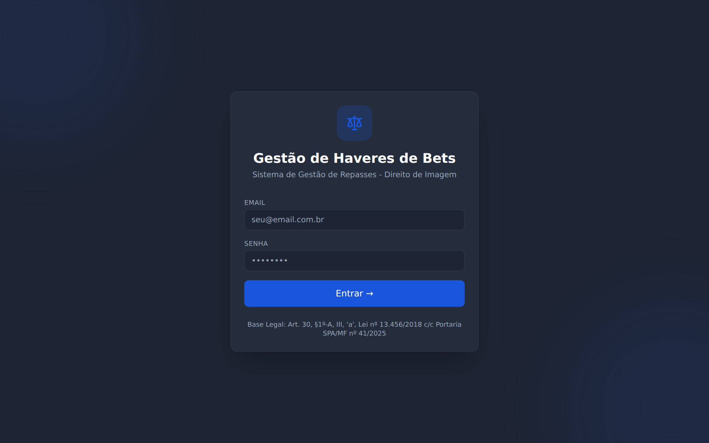

> 💡 Cada pessoa tem o próprio login. Não compartilhe sua senha — tudo o que você faz
> fica registrado no seu nome na Auditoria (isso protege você e o escritório).

### Ajuda dentro do próprio sistema

Em todas as telas e abas existe um pequeno **círculo com "?"**. Passe o mouse por cima
(ou toque, no celular) e um balão explica como aquela função trabalha:

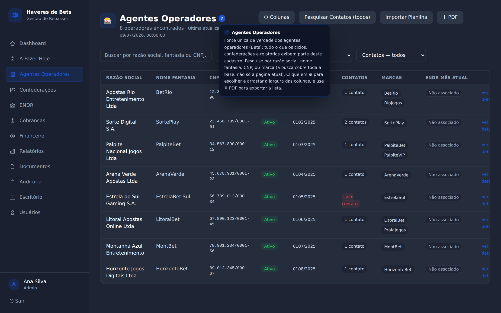

---

# 2. Conceitos em 1 minuto

| Termo | O que significa |
|---|---|
| **Agente Operador (Bet)** | A casa de apostas que deve o repasse. |
| **Confederação** | O cliente do escritório que recebe o repasse (CBTM, CBT, CBW, CBH). |
| **Competência** | O mês a que o pagamento se refere (ex.: julho/2026). |
| **Ciclo** | A cobrança de uma competência para uma confederação (ex.: "CBTM · 07/2026"). |
| **Conclusão** | A situação da Bet no mês: **Adimplente**, **Inadimplente**, **ENDR**, **Consignação em Pagamento** ou **Sem Obrigação Corrente**. É calculada automaticamente (pagou → Adimplente; está no ENDR → ENDR; senão → Inadimplente) e pode ser ajustada manualmente. |
| **ENDR** | Escritório Nacional de Direitos de Rateio. Quando a Bet repassa via ENDR, a cobrança individual daquele mês fica suspensa. |
| **Fase 1 / Fase 2** | Fase 1 = dinheiro que **entra** (Bets → confederação). Fase 2 = dinheiro que **sai** (repartição aos beneficiários conforme as regras de rateio). |

> 🧭 **Regra de ouro do sistema:** o cadastro dos Agentes Operadores é a **fonte única
> da verdade**. Ciclos, confederações e relatórios apenas *espelham* esse cadastro —
> nada é digitado duas vezes, e um recebimento registrado em qualquer tela vale para
> o sistema inteiro.

---

# 3. Central de Controle (Dashboard)

É a primeira tela após o login — o "painel do carro" do sistema.

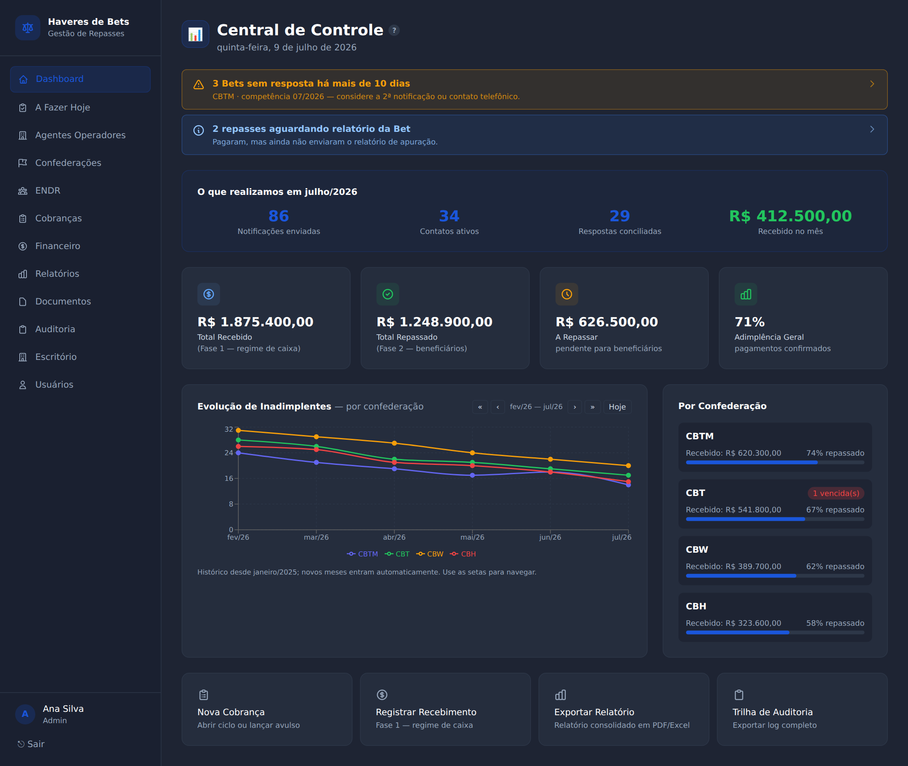

O que você vê, de cima para baixo:

1. **Alertas inteligentes** — faixas coloridas com o que exige atenção (ex.: "3 Bets sem
   resposta há mais de 10 dias"). Clique na faixa para ir direto à tela de solução.
2. **O que realizamos no mês** — notificações enviadas, contatos, respostas conciliadas
   e o valor recebido. Ótimo para mostrar produtividade ao cliente.
3. **Os 4 indicadores** — Total Recebido (Fase 1), Total Repassado (Fase 2), A Repassar
   e a Adimplência Geral da competência.
4. **Evolução de Inadimplentes** — gráfico com uma linha por confederação, desde
   janeiro/2025. Use as setas **« ‹ › »** para navegar no tempo e **Hoje** para voltar.
5. **Por Confederação** — quanto cada cliente recebeu e o % já repassado.
6. **Atalhos rápidos** — Nova Cobrança, Registrar Recebimento, Exportar Relatório e
   Trilha de Auditoria.

---

# 4. A Fazer Hoje

O sistema **monta sozinho** a lista de pendências do escritório — você não precisa
lembrar de nada de cabeça.

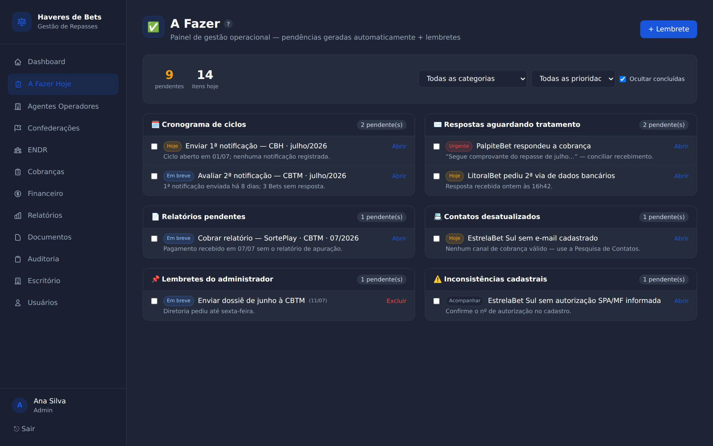

As pendências vêm organizadas por categoria:

- 🗓️ **Cronograma de ciclos** — abrir ciclo do mês, enviar 1ª/2ª notificação;
- ✉️ **Respostas aguardando** — Bets que responderam e esperam tratamento;
- 📄 **Relatórios pendentes** — Bets que pagaram mas não mandaram o relatório;
- 📇 **Contatos desatualizados** — Bets sem canal de cobrança válido;
- 🤝 **Tratativas** — negociações em andamento (ex.: consignação);
- 📌 **Lembretes do administrador** — tarefas criadas manualmente;
- ⏳ **Prazo de fechamento** — avisos nos últimos 5 dias do mês;
- ⚠️ **Inconsistências cadastrais** — dados faltando no cadastro.

**Como usar (passo a passo):**

1. Marque o **checkbox** quando concluir um item — ele fica riscado;
2. Use os filtros do topo (categoria, prioridade, "ocultar concluídas");
3. Clique em **Abrir** para ir à tela onde a tarefa se resolve;
4. Para criar uma tarefa sua: **+ Lembrete** → título, detalhes e prazo → **Criar**.

> 💡 Tarefas de relatório "renascem" automaticamente na competência seguinte — o
> sistema entende que todo mês há um novo relatório a cobrar.

---

# 5. Agentes Operadores (a base de tudo)

A lista de todas as Bets. **O que é alterado aqui vale para o sistema inteiro.**

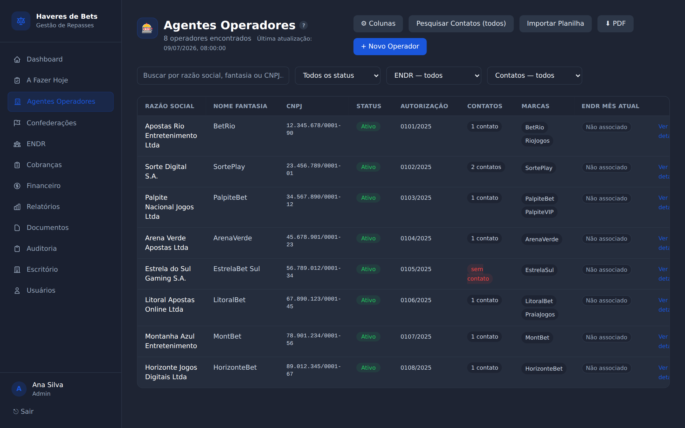

**O que dá para fazer:**

- **Buscar** por razão social, nome fantasia, CNPJ **ou marca** — a busca varre a base
  inteira, não só a página em exibição;
- **⚙ Colunas** — escolher quais colunas aparecem; arraste a borda do título para
  ajustar a largura (a preferência fica salva no seu navegador);
- **⬇ PDF** — exportar a lista em PDF;
- **Pesquisar Contatos (todos)** — o robô procura contatos públicos (site oficial,
  e-mails do domínio) e cria *sugestões* que você aprova ou rejeita;
- **+ Novo Operador** — cadastrar uma Bet;
- **Importar Planilha** — carga em massa a partir da planilha da SPA/MF.

### 5.1 A ficha da Bet (clique no nome)

A ficha tem 9 abas — o "?" no canto da barra explica cada uma:

| Aba | O que tem |
|---|---|
| **Dados Cadastrais** | Razão social, CNPJ, autorização SPA/MF, endereço, status. |
| **Marcas Vinculadas** | Os sites/marcas da Bet (sem limite de quantidade). |
| **Responsáveis** | Pessoas de contato por papel (legal, financeiro, jurídico). |
| **ENDR** | Meses em que a Bet está no ENDR — *somente leitura* (gerencie na tela ENDR). |
| **Contatos** | E-mails e telefones usados na cobrança. |
| **Pesquisa de Contatos** | Sugestões automáticas de contato para aprovar. |
| **Histórico de Pagamentos** | Consolidado por confederação: total recebido, último pagamento, relatório. Setas navegam o histórico mensal desde jan/2025. |
| **Documentos** | Arquivos da Bet (qualquer formato, até 25 MB). |
| **Auditoria** | Tudo o que já foi feito com esse cadastro, por quem e quando. |

---

# 6. Confederações (os clientes)

A lista mostra um cartão por confederação com a situação da competência vigente.
Clicando, você entra na área do cliente — a aba mais usada é a **Visão Geral**:

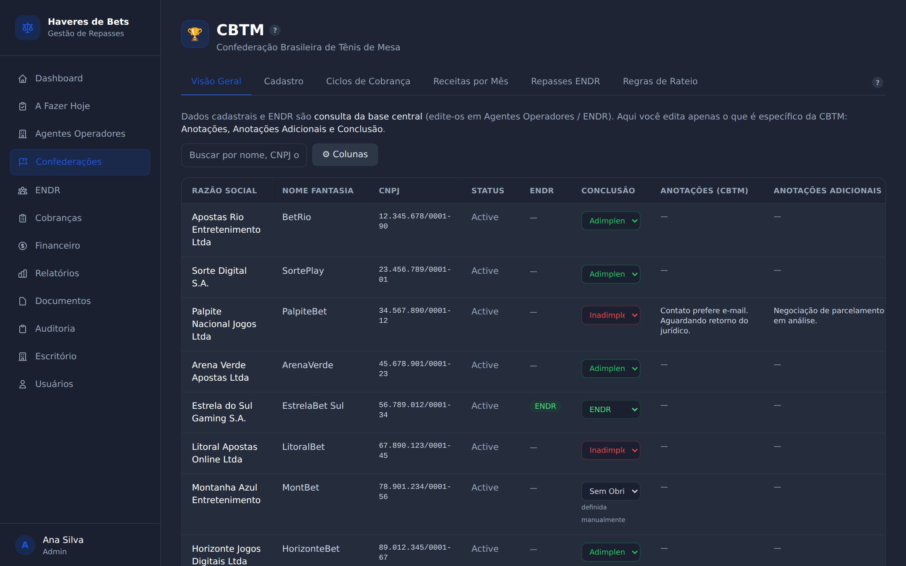

Aqui estão **todas as Bets vistas pelos olhos daquela confederação**:

- Os dados cadastrais e o ENDR são *espelho* da base central (não se editam aqui);
- O que **se edita aqui** é o que é específico da relação com esse cliente:
  - **Conclusão** — clique no seletor e escolha a situação; a opção *(automática)*
    devolve o cálculo do sistema. Quando você define à mão, aparece a etiqueta
    "manual" (Consignação e Sem Obrigação são sempre manuais);
  - **Anotações** e **Anotações Adicionais** — texto livre por Bet.
- As colunas são **redimensionáveis** (arraste a borda do título).

As demais abas: **Cadastro** (dados do cliente), **Ciclos de Cobrança** (lista dos
meses), **Receitas por Mês**, **Repasses ENDR** (registro dos valores recebidos via
ENDR, com o botão *Registrar relatório* quando o relatório chegar ~30 dias depois) e
**Regras de Rateio** (percentuais de repartição — só o administrador edita).

---

# 7. Cobranças — o coração do trabalho mensal

### 7.1 A lista de ciclos

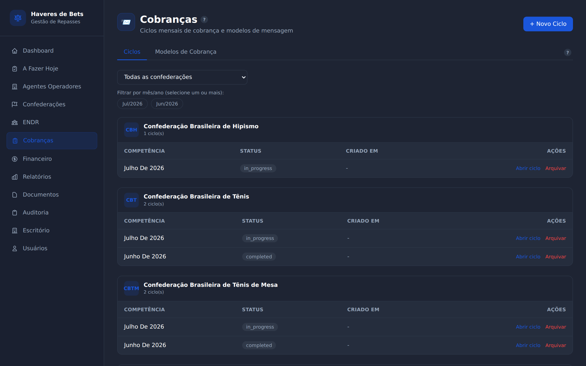

Os ciclos vêm agrupados por confederação, do mês mais recente para o mais antigo.
Na aba **Modelos de Cobrança** ficam os textos padrão dos e-mails, que aceitam
variáveis automáticas como `{bet}`, `{mes}`, `{valor}` e `{prazo}`.

**Para abrir o mês:** clique em **+ Novo Ciclo**, escolha a confederação e a
competência. Pronto — o ciclo nasce espelhando a base central (nenhuma lista é
duplicada).

### 7.2 Dentro do ciclo

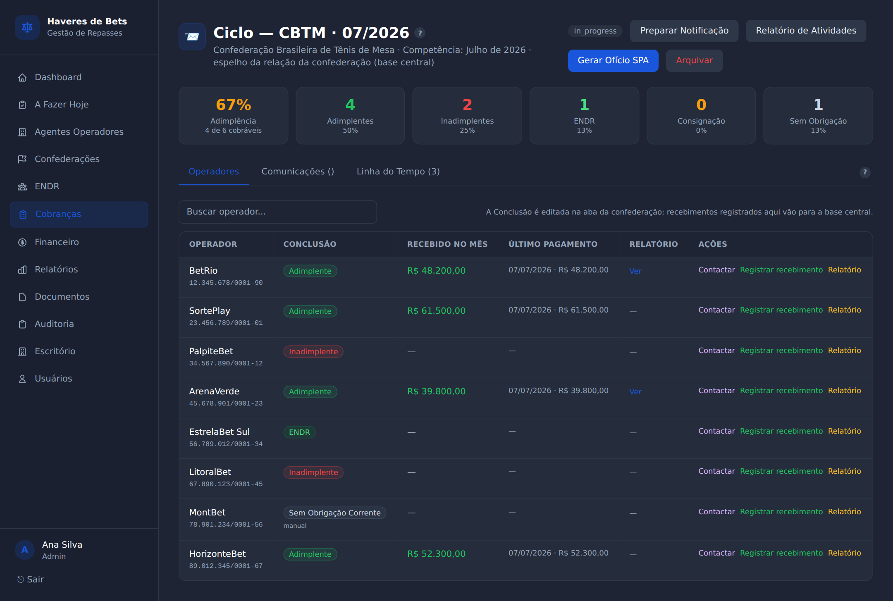

De cima para baixo:

- **Resumo por Conclusão** — adimplência calculada sobre as Bets "cobráveis"
  (o total menos ENDR, Consignação e Sem Obrigação);
- **Aba Operadores** — a tabela do mês, com a Conclusão, o recebido no mês, o último
  pagamento, o relatório e as **Ações** por linha;
- **Aba Comunicações** — e-mails enviados e respostas do ciclo, com protocolo;
- **Aba Linha do Tempo** — o diário de bordo do mês (notificações, contatos,
  recebimentos), pronto para virar evidência.

**O mês típico, passo a passo:**

1. **Preparar Notificação** → o sistema monta a lista com **apenas os inadimplentes
   pré-selecionados** (ENDR, adimplentes etc. podem ser incluídos à mão) e o texto do
   modelo → revise → **Enviar**. Cada envio ganha um **protocolo** (ex.:
   `CBTM-202607-00042`);
2. As **respostas** chegam sozinhas na aba Comunicações (sincronização automática);
3. Quando a Bet paga: **Registrar recebimento** na linha dela → valor e data → o
   sistema grava na base central e a Conclusão vira **Adimplente** na hora;
4. Quando o relatório de apuração chega: **Relatório** na linha → anexe o arquivo;
5. **Gerar Ofício SPA** → gera o ofício ao regulador com a lista de inadimplentes;
6. **Relatório de Atividades** → PDF com todas as diligências do mês (ótimo para
   prestar contas ao cliente);
7. Virou o mês? O administrador pode **Arquivar** o ciclo antigo — ele sai da lista,
   mas o histórico fica guardado para sempre.

> 💡 **Contactar** (em cada linha) abre o painel multicanal: e-mail, WhatsApp e registro
> de ligação — tudo entra na Linha do Tempo automaticamente.

---

# 8. ENDR

Tela dedicada ao Escritório Nacional de Direitos de Rateio — **é aqui (e só aqui) que
se gerencia** quais Bets estão no ENDR em cada mês.

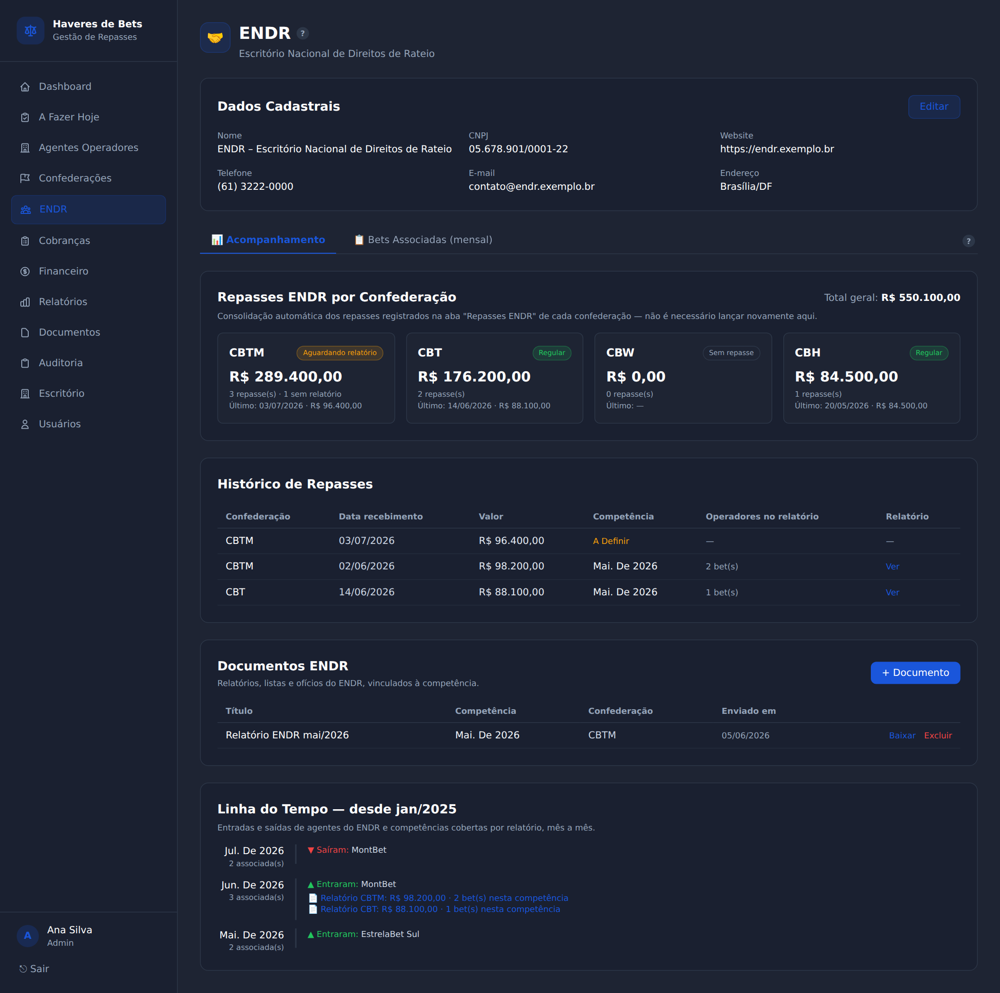

- **Aba Acompanhamento** — os repasses ENDR registrados nas confederações aparecem
  aqui **automaticamente** (sem redigitação): total por confederação, situação
  (Regular / Aguardando relatório / Sem repasse), histórico de repasses, documentos
  por competência e a **linha do tempo desde 2025** mostrando quem entrou/saiu do
  ENDR e quais competências cada relatório cobriu.
- **Aba Bets Associadas (mensal)** — escolha o mês e veja/edite a lista. **+ Adicionar
  Bet** permite marcar várias Bets e vários meses de uma vez. Associar uma Bet
  **suspende a cobrança individual** dela naquela competência.

> 📌 O fluxo real do ENDR: o **dinheiro chega primeiro** (registre o valor na aba
> Repasses ENDR da confederação) e o **relatório vem ~30 dias depois** — quando chegar,
> use *Registrar relatório* para informar a competência e as Bets cobertas; o sistema
> cria as associações do mês sozinho.

---

# 9. Financeiro

O "ERP" do escritório — cada confederação é uma estrutura financeira independente
(selecione o cliente no topo).

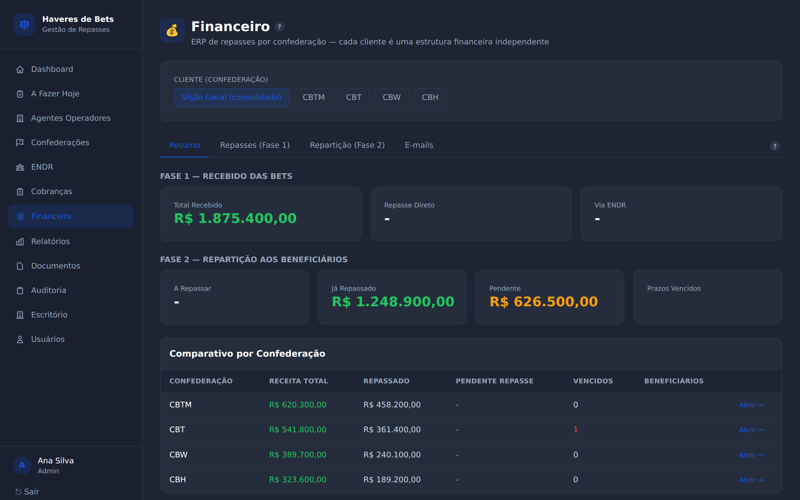

- **Resumo** — panorama do cliente selecionado;
- **Repasses (Fase 1)** — tudo o que **entrou**: pelos ciclos, lançamentos avulsos e
  ENDR. O lançamento avulso pode ficar com competência "a definir" até o relatório da
  Bet chegar — depois é só editar e completar;
- **Repartição (Fase 2)** — o que **sai** para os beneficiários, seguindo as regras de
  rateio; acompanhe parcelas pagas, pendentes e vencidas, e o cadastro de
  beneficiários;
- **E-mails** — a caixa de conciliação: **Sincronizar** importa as respostas da caixa
  dedicada `gestaorepasses@vascav.com.br`; mensagens não identificadas podem ser
  vinculadas à Bet manualmente (com sugestão da IA).

---

# 10. Relatórios

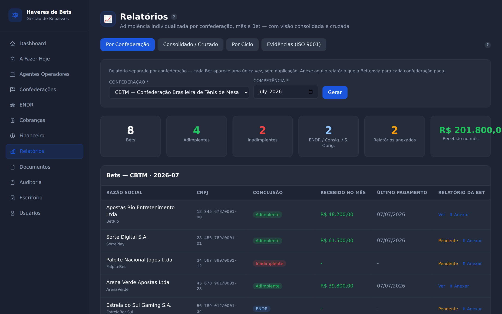

Quatro visões (o "?" explica cada uma):

1. **Por Confederação** *(a principal)* — escolha o cliente e a competência; cada Bet
   aparece **uma única vez**, com a Conclusão, o recebido e o relatório. Use
   **⬆ Anexar** na linha para guardar o relatório que a Bet enviou àquela
   confederação;
2. **Consolidado / Cruzado** — filtros combináveis + exportação **Excel/PDF**;
3. **Por Ciclo** — fotografia de um ciclo específico + **Relatório de Atividades**;
4. **Evidências (ISO 9001)** — o dossiê mensal auditável; **✉ Enviar ao escritório**
   manda para revisão interna antes de encaminhar ao cliente.

---

# 11. Documentos

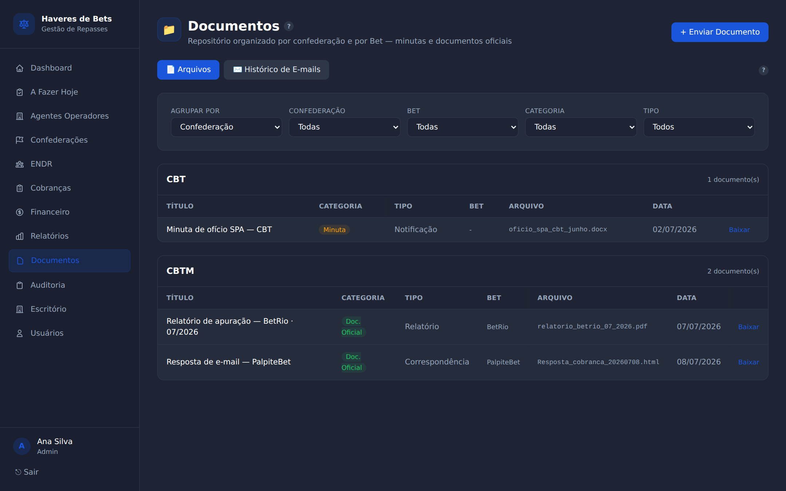

- **Arquivos** — repositório central, agrupado por confederação ou por Bet, com filtro
  de categoria (minuta × documento oficial) e tipo. Tudo o que é anexado nos ciclos e
  relatórios também aparece aqui automaticamente;
- **Histórico de E-mails** — selecione a Bet e veja **todos** os envios e respostas,
  com protocolo; **⬇ Baixar dossiê** gera um arquivo único para auditoria externa.

---

# 12. Auditoria, Escritório e Usuários (administração)

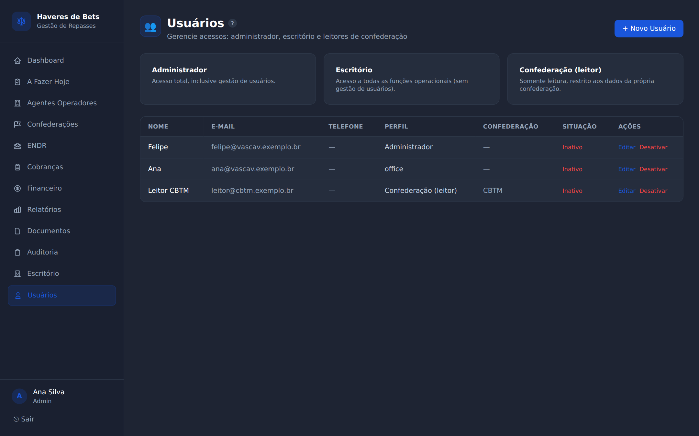

- **Auditoria** — quem fez o quê, quando e em qual registro. Filtros combináveis e
  exportação em PDF. *Ninguém apaga a trilha.*
- **Escritório** — dados usados nas assinaturas, ofícios e no e-mail de revisão.
- **Usuários** — os acessos: **Administrador** (tudo, inclusive arquivar ciclos e
  editar rateio), **Escritório** (operação diária) e **Leitor de Confederação** (vê
  apenas os dados do próprio cliente, sem editar).

---

# 13. Usando no celular

O sistema é 100% responsivo — nada para instalar, é o mesmo endereço no navegador.

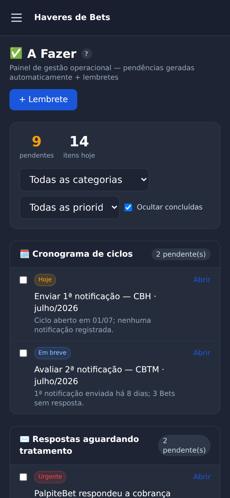 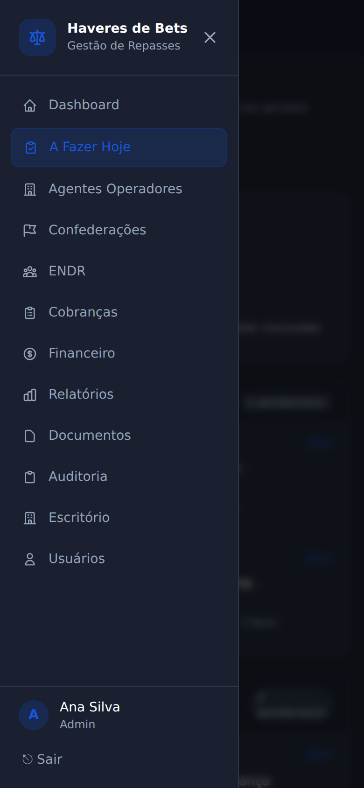

- O menu vira o botão **☰** no topo;
- As tabelas deslizam para o lado com o dedo;
- Os balões "?" abrem com um toque.

---

# 14. Avisos do sistema (toasts)

As confirmações aparecem como **cartões flutuantes** no canto da tela:
**verde** = deu certo · **vermelho** = deu erro · **amarelo** = falta algo/atenção.

Se aparecer *"Sem conexão com o servidor — ele pode estar sendo atualizado"*, aguarde
alguns instantes e tente de novo (é normal durante as atualizações do sistema).

---

# 15. O mês em uma página (cola rápida)

| Quando | O quê | Onde |
|---|---|---|
| Início do mês | Abrir os ciclos da competência | Cobranças → + Novo Ciclo |
| Dia 1–5 | Enviar a 1ª notificação (inadimplentes já vêm marcados) | Ciclo → Preparar Notificação |
| Todo dia | Olhar as pendências e as respostas | A Fazer Hoje |
| Ao receber pagamento | Registrar recebimento (vira Adimplente na hora) | Ciclo → linha da Bet |
| Ao receber relatório | Anexar o arquivo | Ciclo ou Relatórios → Por Confederação |
| Sem resposta ~10 dias | 2ª notificação / Contactar | Ciclo |
| ENDR repassou | Registrar valor; relatório depois | Confederação → Repasses ENDR |
| Fim do mês | Ofício SPA + Relatório de Atividades + dossiê | Ciclo / Relatórios |
| Virada | Admin arquiva ciclos antigos | Cobranças |

---

# 16. Perguntas frequentes

**Esqueci minha senha.** Peça ao administrador — ele redefine na tela Usuários.

**Registrei um pagamento no ciclo; preciso repetir em outro lugar?** Não. Tudo vai
para a base central: aparece no ciclo, na ficha da Bet, no Financeiro e nos relatórios.

**A Conclusão está errada.** Na confederação → Visão Geral, ajuste no seletor. Para
voltar ao cálculo automático, escolha a opção *(automática)*.

**A Bet aparece como Inadimplente, mas está no ENDR.** Confira na tela **ENDR → Bets
Associadas** se ela está associada naquele mês — é lá que se gerencia.

**Posso apagar um ciclo antigo?** Apagar não; o administrador pode **arquivar** — some
da lista, mas o histórico fica preservado.

**De qual e-mail saem as cobranças?** Da caixa dedicada
`gestaorepasses@vascav.com.br` — e as respostas voltam para ela, organizadas
automaticamente em pastas por confederação.

---

*Manual do Usuário · Sistema de Gestão de Haveres de Bets · Vascav Advocacia · v2.0 (julho/2026).*
*Dúvidas ou sugestões: fale com o administrador do sistema.*
