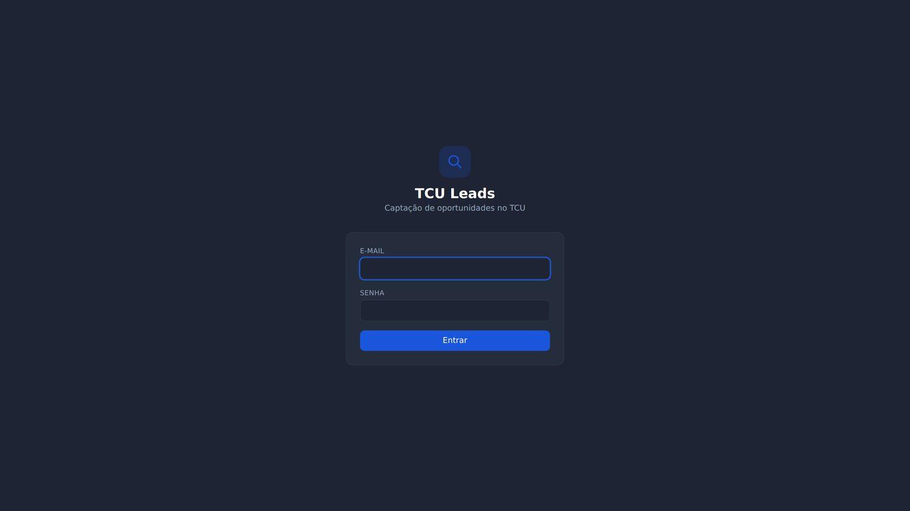
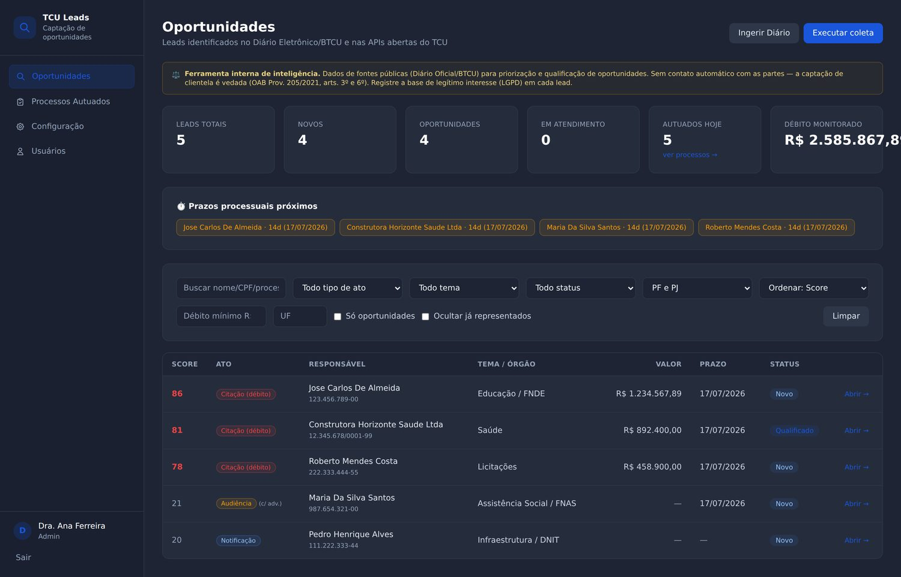
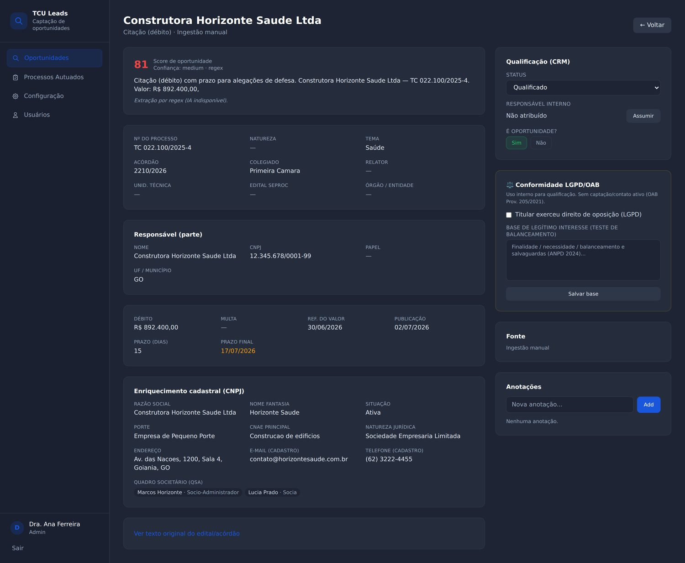
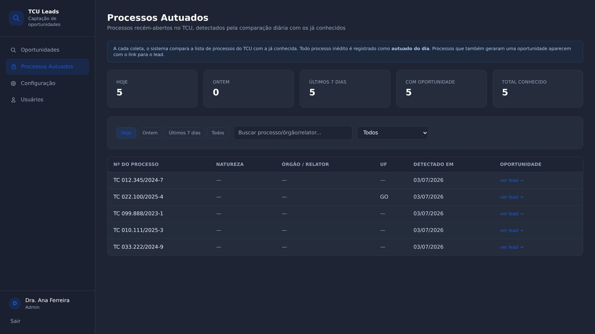
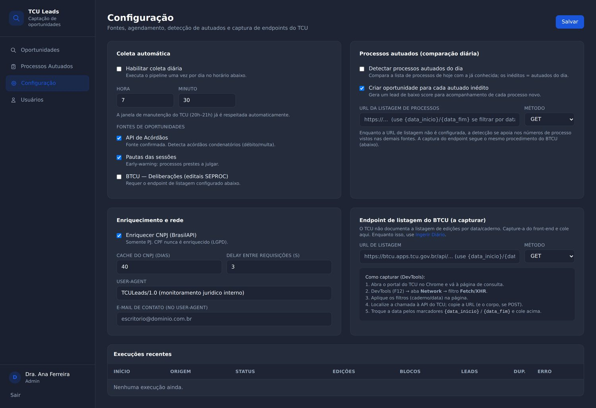
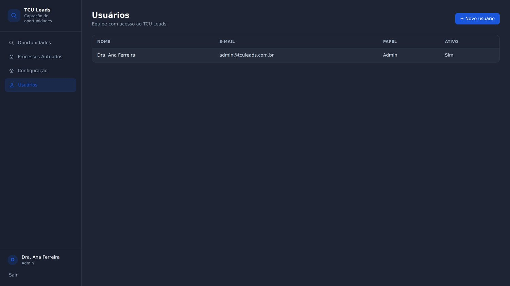

# TCU Leads — Guia de Publicação e Uso

Três partes, na ordem: **criar o servidor** (DigitalOcean) e obter o IP, **criar o
endereço** (subdomínio no Registro.BR) e um **tour** pelas telas. Escrito para ser
seguido sem conhecimento técnico — peça apoio do TI apenas nos comandos do servidor.

> Existe também uma versão ilustrada em página única: abra o arquivo
> [`guia-publicacao.html`](guia-publicacao.html) no navegador (as telas já vêm embutidas).

- Servidor: **DigitalOcean** · Endereço: **tculeads.vascav.com.br** · Segurança: **HTTPS incluso** · Custo aprox.: **US$ 6–12/mês**

---

## Parte 1 — Criar o servidor e obter o IP (DigitalOcean · ~5 min)

O "servidor" é um computador na nuvem, ligado 24h, onde o sistema roda. Na
DigitalOcean ele se chama **Droplet**. Ao final você copia o **número de IP**
(algo como `203.0.113.45`), usado na Parte 2.

1. **Entrar e iniciar** — acesse [cloud.digitalocean.com](https://cloud.digitalocean.com), faça login. No topo, clique em **Create → Droplets**.
2. **Região** — escolha um datacenter próximo. A DigitalOcean não tem região no Brasil; use **New York** (boa latência) ou **Toronto**.
3. **Imagem (sistema)** — em *Choose an image*, deixe **Ubuntu** e selecione **24.04 (LTS) x64**.
4. **Tamanho** — tipo **Basic**, plano **Regular**. Recomendado: **2 GB RAM / 1 CPU** (US$ 12/mês); o mínimo de **1 GB** (US$ 6/mês) também funciona.
5. **Acesso** — em *Authentication Method*, escolha **Password** e defina uma **senha de root forte** (anote-a). Ou use **SSH Key**, se o TI preferir.
6. **Nomear e criar** — em *Hostname*, digite `tculeads`. Clique em **Create Droplet** e aguarde ~1 min.
7. **Copiar o IP** — quando o Droplet aparecer na lista, copie o **endereço IPv4** exibido. **Esse é o IP.**

✅ **Resultado:** você tem o número de IP do servidor.

---

## Parte 2 — Criar o endereço (subdomínio) no Registro.BR (~5 min)

Agora você aponta **tculeads.vascav.com.br** para o IP, criando um registro do
tipo **A** na zona de DNS do domínio `vascav.com.br`.

1. **Painel do domínio** — acesse [registro.br](https://registro.br), faça login e clique no domínio **vascav.com.br**.
2. **Editor de DNS** — abra a aba **DNS → Editar Zona**.
   - Se aparecer uma tela de **"DNS Parking"** (servidores `ns1/ns2.dns-parking.com`) em vez de "Editar Zona", clique em **Alterar servidores DNS** e escolha usar os **servidores DNS do Registro.br** — só então a zona fica editável. Isso é raro para um domínio já em uso.
   - Se o domínio usar outro provedor de DNS (Cloudflare, GoDaddy etc.), faça o mesmo registro lá — o conceito é idêntico.
3. **Adicionar o registro** (⚠️ **apenas adicione** — como `vascav.com.br` já é o domínio ativo do escritório com e-mail, não edite nem apague nenhum registro existente, em especial os do tipo `MX`):
   - **Nome / Host:** `tculeads`
   - **Tipo:** `A`
   - **Valor / Dados:** o **IP da Parte 1**
   - **TTL:** padrão
4. **Salvar** — a propagação leva de minutos a ~1 hora.

> ⚠️ Digite o subdomínio em minúsculas (`tculeads`). O endereço final é
> **tculeads.vascav.com.br**.

✅ **Resultado:** o endereço passa a apontar para o seu servidor.

### Ligar o sistema (os dois comandos)

No servidor, como **root**:

```bash
# passo 1 de 2 — baixa e prepara tudo
curl -fsSL https://raw.githubusercontent.com/lfelipevmc/gestaorepassesbets/main/tcu-leads/infra/setup-servidor.sh -o setup.sh
bash setup.sh tculeads.vascav.com.br
```

O script pede para criar o arquivo de configuração (`.env`) com o login de
administrador, a chave de IA (opcional) e o e-mail. Depois:

```bash
# passo 2 de 2 — sobe o sistema e obtém o HTTPS
bash /opt/gestaorepassesbets/tcu-leads/infra/continuar-instalacao.sh tculeads.vascav.com.br seu-email@vascav.com.br
```

Ao final, acesse **https://tculeads.vascav.com.br** e entre com o login definido
no `.env`. Detalhes em [`DEPLOY.md`](../DEPLOY.md).

---

## Parte 3 — As telas do sistema

Capturas reais do TCU Leads com dados de exemplo.

### Tela 1 — Entrada
Acesso com e-mail e senha. Cada pessoa da equipe tem o seu login; o primeiro é o
administrador, definido na instalação.



### Tela 2 — Oportunidades (principal)
O painel central. No topo, o resumo do dia; abaixo, a lista ordenada por uma
**nota de 0 a 100**. Faixa âmbar de conformidade (OAB), cartões de resumo
(inclui "Autuados hoje"), prazos de 15 dias vencendo, filtros e o botão
**"Ingerir Diário"**.



### Tela 3 — Detalhe da oportunidade
Dados do processo, valores e prazo e, para empresas, o **enriquecimento
cadastral** (razão social, CNAE, sócios). À direita: **CRM** (status, assumir,
anotações) e o painel **LGPD/OAB** (base de legítimo interesse, objeção).



### Tela 4 — Processos Autuados (novidade)
A cada coleta, compara a lista de processos do TCU com a já conhecida e marca os
**recém-abertos** como autuados do dia. Filtros Hoje / Ontem / 7 dias; link
"ver lead" quando o processo também virou oportunidade.



### Tela 5 — Configuração
Onde você **liga a coleta diária**, escolhe o horário e as fontes, configura a
captura dos endereços do BTCU e de processos, e vê o histórico de execuções.



### Tela 6 — Usuários
O administrador cadastra a equipe do escritório (administrador ou membro).



---

## Ordem recomendada

1. Parte 1 (servidor/IP) → 2. Parte 2 (endereço + os dois comandos) →
3. primeiro acesso, trocar a senha e cadastrar a equipe.

Para ver oportunidades imediatamente, use **"Ingerir Diário"** enquanto a coleta
automática é ligada.
